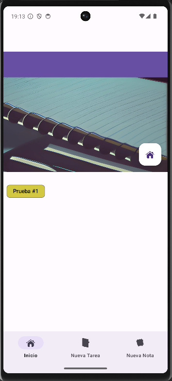
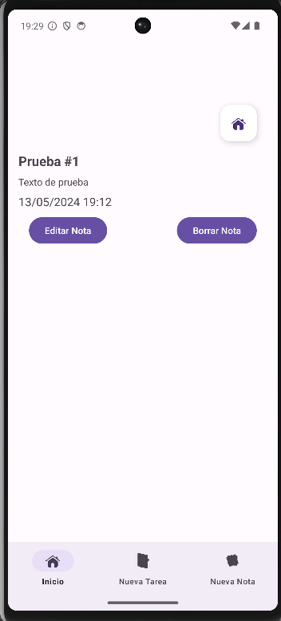

# Titulo
Task Manager
# Concepto
Aplicación para almacenamiento de tareas, con fecha de vencimiento, y notas.

# Navegación
Como se aprecia en la siguiente imagen, correspondiente a los archivos de layout

...la aplicación consta de los siguientes fragmentos:
- **Actividad principal** (activity_main.xml): desde ella, se carga el fragmento de bienvenida, de entrada a la aplicación.
- **Fragmento de bienvenida** (fragment_welcome.xml): se establece como portada de la aplicación 
  
  En dicha portada ya se puede acceder a las opciones para crear nueva tarea o nueva nota, o bien acceder al siguiente fragmento, pulsando en el botón comenzar. En todo el ciclo de vida de la aplicación se mantienen dos menús, el inferior, y uno lateral que describiremos más adelante.
- **Fragmento de elección de operación** (*fragment_choice.xml*): en dicho fragmento se tiene acceso a las operaciones que se van a realizar.
  
  Tenemos un RadioGroup con dos botones de radio que nos permiten crear nuevos ítems, tanto tarea como nota, si se pincha cualquiera de ambas opciones, y se pulsa a continuación el botón 'Siguiente'. Si se pulsa dicho botón sin haber seleccionado alguna de las dos opciones, una Toast nos informará de que no hemos seleccionado ninguna opción.
- **Fragmento para crear nueva nota** (*fragment_new_note.xml*): si hemos seleccionado 'Nueva Nota' y pulsado 'Siguiente', nos llevará a este fragmento.
  
  Donde podemos ingresar el título y el contenido de la nota.
- **Fragmento para crear nueva tarea** (*fragment_new_task.xml*): análogo al anterior, se abre si elegimos 'Nueva tarea' y pulsamos en 'Siguiente'.
  
  Vemos que tiene los mismos campos que en el caso anterior, más un botón para seleccionar fecha. Si pulsamos, se abre un DatePicker para elegir la fecha límite para la tarea:
  
- **Fragmento para mostrar tareas existentes**(*fragment_tasks.xml*): Si desde la pantalla de selección de operación pulsamos el botón 'Tareas existentes' nos lleva a este fragmento:
  
  Donde vemos las tareas que están activas en ese momento. Si pulsamos en la Chip de dicha tarea, en la que se visualiza el título, nos lleva al contenido de dicha tarea (presente en un fragmento llamado *fragment_show_task.xml*):
  
  El título, el contenido textual de la misma, la fecha de creación y la fecha de vencimiento. Además hay un botón para borrar dicha tarea.
- **Fragmento para mostrar notas existentes**(*fragment_notes.xml*): De forma análoga al funcionamiento de la pantalla para visualizar notas existentes.
  
  E, igualmente, al pinchar en la nota, se abre su contenido (al abrirse un nuevo fragmento *fragment_show_notes.xml*):
  
  Igualmente, dispone del botón para borrar nota, pero, además, tiene un botón adicional para editar la nota. Las notas, al contrario que las tareas, son editables.
  
  Al pulsar sobre el botón de edición, los botones de edición y borrado se ocultan, y aparece en su lugar un botón para confirmar edición.

- **Menú lateral**: desde la actividad principal se ha definido, además del menú inferior, un menú lateral que permite el acceso a las funciones principales:
  
  Dicho menú es deslizable y ocultable.
- **Botón flotante**: asimismo, desde cualquier pantalla secundaria es posible volver a la pantalla de elección de acción, pulsando en el botón flotante:
  
- **Menú inferior**: y, como decíamos, en todo momento se visualiza el menú inferior, para poder acceder a la pantalla de elección de acción, o bien, de forma rápida, crear nueva nota, o nueva tarea.
  

  Tanto las notas como las tareas se almacenan en archivos **json** ocultos al usuario, internos, uno llamado *notes.json* y otro llamado *tasks.json*, cuyo contenido se maneja con los atributos existentes en dos *data classes* llamadas *Note.kt* y *Task.kt*:
  
  

Para el paso de datos entre los distintos fragmentos la información se ha serializado usando un ViewModel, en la clase *SharedViewModel.kt*:

